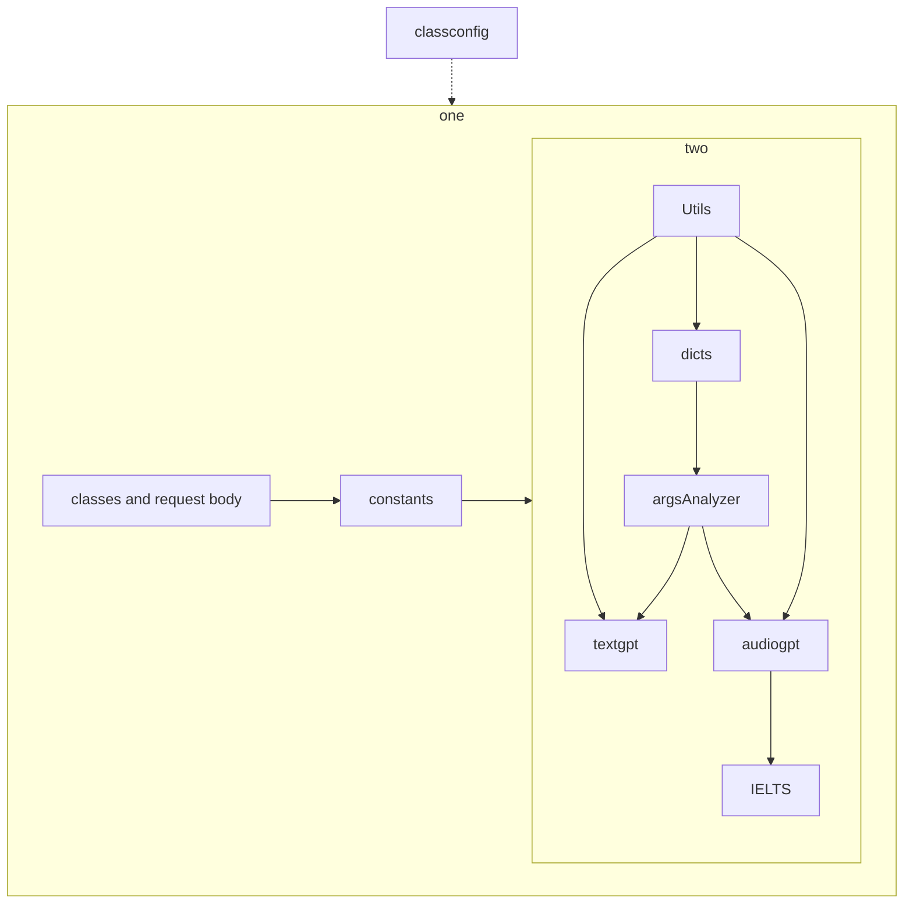

### strcture

```mermaid
flowchart TB

subgraph one

c[classes and request body]-->constants

subgraph two

dicts-->argsAnalyzer

Utils-->dicts

Utils-->textgpt
argsAnalyzer-->textgpt

argsAnalyzer-->audiogpt
Utils-->audiogpt

audiogpt-->IELTS
end
constants-->two
end

classconfig-.->one
```